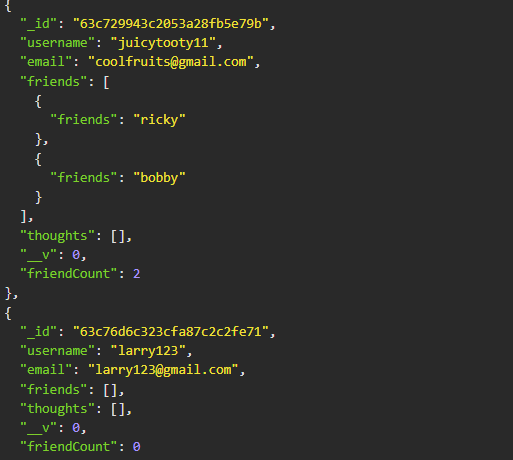
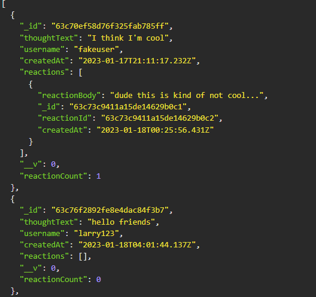

# Social-Network-APIs 

This application was created to be used as the backend for a social networking application. It can track "thoughts" of an individual and also keep track of what they've posted , who's replied, and what friends they have.

 

## Usage 

This is a backend-application and is not deployed live, so users would have to clone the repository and run the server on their code editor. In order to interact with it users would have to use programs such as Insomnia.

## Installation 

N/A

## License

See repository

## Contributing 

N/A

## Questions
--GITHUB USERNAME--
ssangwang
--EMAIL--
ssangwang@009@umn.edu
## Tests 

N/A